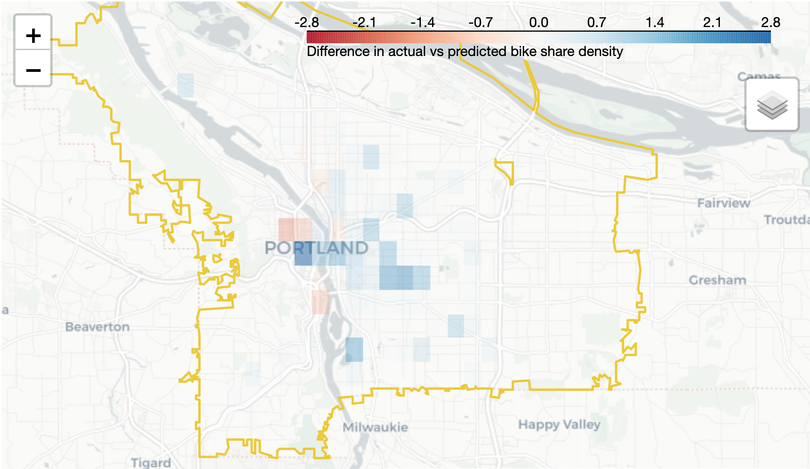

# Better Bike Share
Helping bike share companies better allocate their resources

## Motivation

Determining optimal bike share locations can be a costly and time consuming task. There is an abundance of geographical data and an opportunity for machine learning to assist companies in determining how to best allocate their limited resources. An optimal allocation of bike shares will lead to more customers enjoying bikes and fewer bikes cluttering the sidewalks.

## Problem Statment
Given limited resources, how can companies optimally meet bike share demands?

## Results and Insights

In this work, a random forest model is trained to understand how bike shares are distributed in successful bike share cities. This model is then used to create an interactive map so that companies can quickly decide how to best allocate their limited resources in existing or new markets.

Insights:
 * Bike shares are placed in **social settings** near amenities like Cafes, bars, and restaurants
 * Bike shares are placed in **bike friendly areas** where the cyling infrastructure is well established

## Tools and Skills

 * AWS S3, Athena, Sagemaker, EC2
 * Streamlit
 * Python
 * GIS
 * Random Forest
 * ETL
 * Feature Engineering
